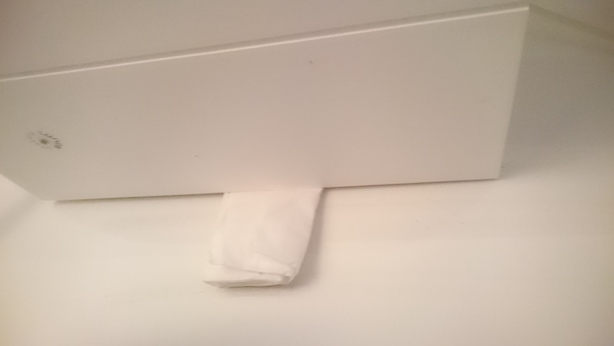

# TuneMyVision[Apartment]

Hi there!

This is a story about my stay in [Vision Apartments Berlin](https://visionapartments.com/en-US/serviced-apartments/berlin-germany/). More precisely, it's a story about how I tuned my apartment.

Let's face it. Companies suck in maintaining things. When I first visited the Apartments, in 2015, I really liked it. Not so on my second visit, in 2018. It's like things had already fallen apart, had seen their best days.

It doesn't need to be that way. And as the (temporary) occupants of the particular apartment, we can leave it in better shape than we got it.

---

Disclaimer.

Doing things I show here is just for guidance. If you try something, you take full responsibility of your actions. If you don't feel up to the tasks, maybe ask the hotel maintenance people to do them (if they don't know how, show them this guide...). :)

---

## Where does the air come from?

I was surprised how stale the air was. Sweaty nights, actually a must to have both windows open. Shouldn't be like this... Buildings are supposed to have fresh air vents, and exhausts, so I (after asking for them), started looking...

### Bathroom

In my bathroom, there's obviously one (pic1).

When I switch the lights on, there's a fan noice from that vent, but... no breeze. 

|Hint|
|---|
|You can test for breeze by placing some dove from your blanket next to the operating fan. If they fall straight down, there's no external air flow.|

*Picture 1. Vent in the bathroom roof*

### Opening the vent

There's no ladder in the apartment, but I found the square wood block (table), _without_ the glass quite handy. Naturally, read the disclaimer and be careful.

Try the lid from different angles, until you get a feel where the snaps might be. There's two and two on opposing sides, and they open quite easily with a firm grip.

You will see...

*Picture 2. Maintenance instructions of the roof fan*

The instructions are pretty good. In brief, they state:

- the filter should be regularly cleaned, by washing it in semi-hot water, with normal dishing liquid
- WARNING: DO NOT RUN THE FAN WHEN FILTER IS REMOVED (i.e. no lights on when filter is out!)

This means, we can easily do the maintenance.

Let's see how the filter looks.

*Picture 3. Bathroom filter before touching it*

That doesn't look bad, but the small dust was cemented so firmly, no air would flow through. I tried.

### Washing

Fan (lights) off, and gently detach the filter. Super easy. Take to kitchen - see before and after pictures.

*Picture 4. Bathroom filter before washing*

*Picture 5. Bathroom filter after washing*

Nice!

Now slip the filter back (it will dry in the wind), snap the cover, and turn on the air! :)

## Why it matters so hugely!

The air vents are intended to work not only when the fan is on, but by gentle gravity/temperature draft even when the fan is off. They are the _only_ means in my apartment to get air out!! (I still don't really know where the air is supposed to come in). If they are blocked like that one, there's no circulation of air. Even if you open the windows, it does little to the cave-like thing the bathroom just became. The filter must not be air-tight.

## Living room

So... I felt pretty good fixing that (without damage to myself of the apartment), so certainly there's something more.

There was!

Above the microwave, there's a cover for an exhaust pipe. I removed the door (two clips, no tools needed), and was able to pull the cover out.

Surprise!

*Picture 6. Look Mom, no pipes!*

Well... that looks alarming at first. But it may not be. The covering was pretty tight so I can (kind of, with a positive attitude) think that the pipe in between would not really have been needed. (If you are the repair man for my apartment, you are welcome to come and install the missing pipe. I have a rough idea how original plans may have had it.)

But this works. The microwave's fan pushes the air to the above empty space. 

Until... there's no exit from there. There are the holes (top left corner) where my microwave fumes would enter back into the apartment.

---

Note: This is why the apartment has a special, plastic-wrapped info sheet about _ALWAYS_ needing to apply both the microwave fan and the main fan, at the same time. _ALWAYS_.

---

So there's a main fan? Yup. 

Using my camera to look behind the corner, I see this.

*Picture 7. Living room fan*

Now, that looks familiar. :)  

Obviously, for the extra info sheet to make any sense, this fan's filter should be clean. Was it? Nope.

You can do the same exercise as for bathroom here, but placing back the cleaned filter was difficult. I ended up removing the whole front cover (the one with the big holes) but that's surprisingly heavy, and you are high up. BE CAREFUL or just ask apartment maintenance to do this job.

## Added extra

After cleanup (since air actually started circulating) the fan made a funny resonating noise. I ended up placing a simple, slightly used handkerchief in between the wall and the fan, and that did the trick. Peaceful!

*Picture 7. Quietness*

## Summary

Doing the above tasks takes maybe an hour, less the second time. 

Yes, the company should have done that, but that mentality is missing a point. It's important for us humans to be able to control our environment. At work, at home, at a temporary apartment. Being able to fix things, and understand how they work adds to our feelings. Fixing is so much better than complaining. :)

I do plan to tell the apartment personnel about the tuning. It's up to them how they react on the other apartments, but at least I've got fresh air now! (it actually helped, just some hours after the cleanups the air was actually breathable in the room, and I will sleep my nights so much better)

---

